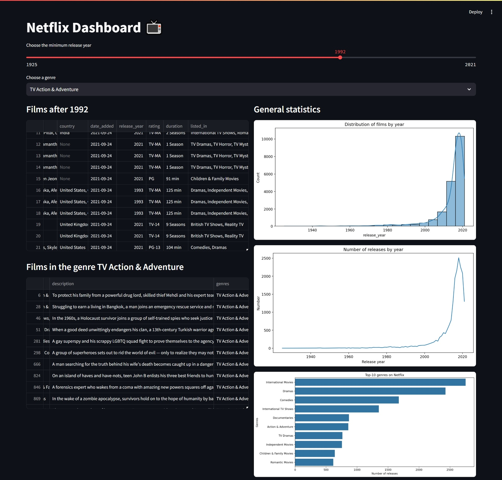

# Netflix Dashboard 📺

An interactive dashboard for analyzing data about movies and shows on Netflix.  
Made using **Streamlet**, **Pandas** and **Seaborn**.
The project uses the Netflix Movies and TV Shows dataset obtained from the website kaggle.com .

## 🚀 Features
- Filtering by release year and genre
- Visualization of releases by year
- Top genres on Netflix
- - Interactive interface on Streamlet

## 📂 Project structure
project/ 
├── data/ #Data (ignored by Git) 
├── screenshots/ #Dashboard Screenshot (see below ⬇️)
├── src/ #Modules: preprocess, analysis, visualization, dasboard, data_loading  
├── main.py #Pipeline launch point 
├── requirements.txt #Dependencies 
└── README.md #Project Description

##  🔑 How to get Kaggle API Key and upload data

To download a dataset from Kaggle, you need an API key. [Official Kaggle API Documentation](https://www.kaggle.com/docs/api#authentication)

## 🚀 First Launch (Preparation)

1. Activate your virtual environment  
   (on Windows):
   .venv\Scripts\activate
2. Run the following command in the terminal to download and preprocess data: python main.py

## 🔄 Next Launches (Dashboard only)

1. Run Streamlit to launch the dashboard:
    streamlet ru src/dashboard.py
    

## 📸 Screenshots

### 🎬 Netflix Dashboard UI
Preview of the interactive Streamlit dashboard analyzing Netflix titles.

## Author
Netflix Data Insights by Harpreet
